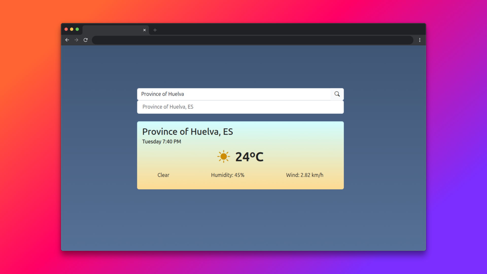

# Tiempo App

Aplicación web desarrollada con Angular que permite consultar el clima actual de cualquier ciudad en tiempo real, utilizando la API de OpenWeatherMap. Incluye búsqueda dinámica, visualización de datos meteorológicos y componentes con estilos responsivos.

## Características

- Búsqueda de ciudades y selección desde un listado.
- Visualización de información meteorológica: temperatura, humedad, viento, estado del clima.
- Tarjeta con estilos e iconos dinámicos según la condición meteorológica.
- Integración con la API de OpenWeatherMap.

## Requerimientos

- Node.js >= 18.x
- npm >= 9.x
- Angular CLI >= 16.x (opcional, para comandos globales)
- Cuenta y API Key de OpenWeatherMap
- Navegador web moderno (Chrome, Firefox, Edge, etc.)

## Instalación

1. Clona el repositorio:
   ```bash
   git clone https://github.com/robertocmt13/tiempo-app.git
   cd tiempo-app
   ```
2. Instala las dependencias:
   ```bash
   npm install
   ```
3. Configura tu clave de API de OpenWeatherMap:
   - Copia el archivo de ejemplo:
     ```bash
     cp src/environments/environment.example.ts src/environments/environment.ts
     ```
   - Edita `src/environments/environment.ts` y coloca tu clave de API en `weatherApiKey`.
   - Asegúrate de que environment.ts esté incluido en .gitignore para no subirlo a repositorios públicos.

## Uso

Inicia la aplicación en modo desarrollo:
```bash
ng serve
```

Abre [http://localhost:4200](http://localhost:4200) en tu navegador.

## Estructura principal

- `src/app/component/search/` — Buscador y listado de ciudades.
- `src/app/component/weather-card/` — Tarjeta de información meteorológica.
- `src/app/service/weather.service.ts` — Servicio para obtener datos de la API.
- `src/environments/environment.ts` — Configuración de la API Key (no subir a GitHub).

## Notas de seguridad

- **No subas tu archivo `environment.ts` con la API Key a repositorios públicos.**
- El archivo ya está en `.gitignore` por defecto.
- Lo ideal sería tener la API Key en el backend, pero al ser un ejercicio sin backend y no ser subido a una web real no he creado un backend.

## Captura de pantalla



## Futuras mejoras

- Autocompletado de ciudades al escribir en el buscador
- Mostrar pronóstico de varios días
- Soporte para geolocalización y clima actual del usuario
- Selección de unidades (°C/°F, km/h/mph)
- Temas claro/oscuro
- Mejoras de accesibilidad y usabilidad
- Tests unitarios y de integración
- Despliegue automático en plataformas cloud

## Licencia

MIT
